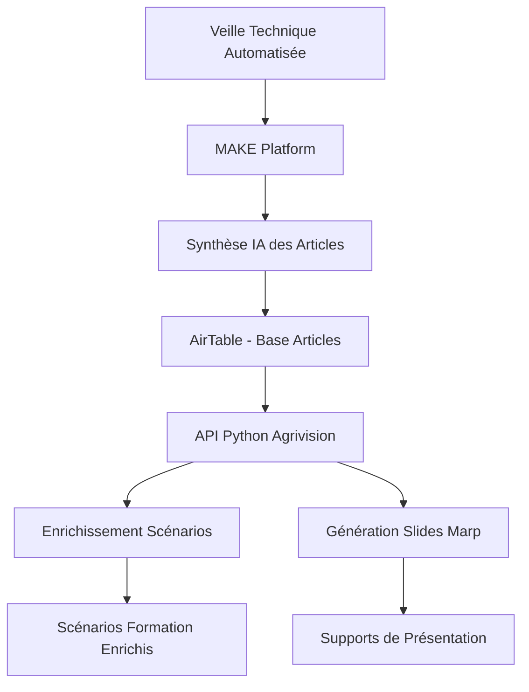

# Agrivision - Pipeline Intelligence Agricole

Une architecture complète d'intelligence artificielle pour la formation agricole, intégrant veille technique automatisée, enrichissement de contenu pédagogique et génération de supports de présentation.

*Projet développé dans le cadre du Hackathon Agreen Defi Tech élevage 2025*

## 🏗️ Architecture Globale



### 🔄 Flux de Données

1. **Veille Technique** : Surveillance automatique des publications scientifiques agricoles
2. **MAKE Platform** : Orchestration et traitement automatisé des articles
3. **Synthèse IA** : Extraction et synthèse intelligente du contenu scientifique
4. **AirTable** : Base de données centralisée des articles synthétisés
5. **API Agrivision** : Service d'enrichissement et génération de contenu pédagogique
6. **Livrables** : Scénarios de formation enrichis et slides de présentation

## 🚀 Fonctionnalités

### 🔬 **Traitement Intelligent**
- Analyse automatique des articles scientifiques
- Extraction de nouveautés et innovations
- Attribution intelligente aux séquences pédagogiques

### 🎯 **Enrichissement Pédagogique**
- Enrichissement de scénarios de formation existants
- Suggestions basées sur les dernières recherches
- Intégration contextuelle des nouveautés scientifiques

### 📊 **Génération de Supports**
- Création automatique de slides Marp
- Formats adaptés à la présentation
- Personnalisation par document source

### 🔄 **Synchronisation Automatisée**
- Intégration AirTable native
- Mise à jour en temps réel
- Gestion de versions et historique

## 📁 Structure du Projet

```
Agrivision/
├── api.py                           # API FastAPI principale
├── src/
│   ├── config.py                    # Configuration centralisée
│   ├── models/
│   │   ├── scientific_article.py   # Modèles articles scientifiques
│   │   └── pedagogical_scenario.py # Modèles scénarios pédagogiques
│   ├── loaders/
│   │   ├── markdown_loader.py       # Chargement fichiers markdown
│   │   └── airtable_loader.py       # Intégration AirTable
│   ├── enrichment/
│   │   └── scenario_enrichment.py  # Enrichissement IA
│   └── processors/
│       └── generate_md_for_marp.py # Génération slides
├── input/                           # Fichiers d'entrée
├── data/                           # Articles scientifiques
├── output/                         # Résultats générés
├── requirements.txt
├── Dockerfile
└── .github/workflows/              # CI/CD automatisé
```

## 🛠 Installation et Configuration

### 1. Installation

```bash
# Cloner le projet
git clone https://github.com/schwaxpl/agrivision.git
cd agrivision

# Installation des dépendances
pip install -r requirements.txt
```

### 2. Configuration des Variables d'Environnement

```bash
# Copier le fichier d'exemple
cp .env.example .env
```

Éditer `.env` avec vos clés API :

```env
# API OpenAI (requis)
OPENAI_API_KEY=your_openai_api_key_here

# Configuration AirTable (optionnel)
AIRTABLE_API_KEY=your_airtable_key
AIRTABLE_BASE_ID=your_base_id
AIRTABLE_TABLE_NAME=Article

# Configuration modèle
DEFAULT_MODEL=gpt-3.5-turbo
DEFAULT_TEMPERATURE=0.1
```

## 🚀 Utilisation

### Démarrage de l'API

```bash
python start_api.py
```

L'API sera disponible sur `http://localhost:8000`

### Documentation Interactive

Accédez à la documentation Swagger : `http://localhost:8000/docs`

## 📡 Endpoints API

### 🔄 **Pipeline Complète (Recommandé)**

```http
POST /enrich-and-slides
```

**Effectue enrichissement + génération slides en une seule fois**

```json
{
  "scenario_json": "input/scenario.json",
  "data_directory": "data", 
  "output_format": "markdown"
}
```

### 🎯 **Endpoints Individuels**

#### Enrichissement de Scénario
```http
POST /enrich
```

#### Génération de Slides
```http
POST /generate-marp-slides
```

#### Synchronisation AirTable
```http
POST /sync-airtable
```

#### Suivi des Tâches
```http
GET /tasks/{task_id}
GET /tasks/{task_id}/logs
```

#### Téléchargement des Résultats
```http
GET /download/{task_id}
```

## 💡 Exemple d'Utilisation Complète

### 1. Synchronisation AirTable (Optionnel)
```bash
curl -X POST "http://localhost:8000/sync-airtable" \
     -H "Content-Type: application/json" \
     -d '{"data_directory": "data", "clean_before_sync": true}'
```

### 2. Pipeline Complète
```bash
curl -X POST "http://localhost:8000/enrich-and-slides" \
     -H "Content-Type: application/json" \
     -d '{"scenario_json": "input/scenario.json", "output_format": "markdown"}'
```

### 3. Suivi et Téléchargement
```bash
# Récupérer le task_id de l'étape précédente
curl -X GET "http://localhost:8000/tasks/{task_id}"

# Télécharger les résultats
curl -X GET "http://localhost:8000/download/{task_id}" -o results.zip
```

## 📦 Déploiement

### Docker

```bash
# Build de l'image
docker build -t agrivision .

# Lancement du conteneur
docker run -p 8000:8000 --env-file .env agrivision
```

### Docker Compose

```yaml
version: '3.8'
services:
  agrivision:
    build: .
    ports:
      - "8000:8000"
    env_file: .env
    volumes:
      - ./data:/app/data
      - ./input:/app/input
      - ./output:/app/output
```

### Render

Déploiement automatique sur [Render](https://render.com) :

1. **Connectez votre repository GitHub**
2. **Configuration automatique** via `Dockerfile`
3. **Variables d'environnement** dans le dashboard Render
4. **Déploiement continu** sur chaque push

```yaml
# render.yaml (configuration optionnelle)
services:
  - type: web
    name: agrivision
    env: docker
    dockerfilePath: ./Dockerfile
    envVars:
      - key: OPENAI_API_KEY
        sync: false
      - key: AIRTABLE_API_KEY
        sync: false
```

## 🔧 Configuration MAKE Platform

### Déclencheurs
- Surveillance RSS des journaux scientifiques
- Monitoring des bases de données de publications
- Alertes par mots-clés agricoles

### Traitement
- Extraction automatique des résumés
- Synthèse via IA générative
- Classification par domaines agricoles

### Sortie vers AirTable
- Création automatique d'enregistrements
- Enrichissement des métadonnées
- Notification de nouveaux articles

le scénario est récupérable dans **veille.blueprint.json**

## 📊 Intégration AirTable

### Structure de Table Recommandée

| Champ | Type | Description |
|-------|------|-------------|
| Article ID | Text | Identifiant unique |
| Titre | Text | Titre de l'article |
| Résumé | Long Text | Contenu synthétisé |
| Mots-clés | Multi-select | Tags thématiques |
| Date Publication | Date | Date de publication |
| Domaine | Single Select | Catégorie agricole |
| Statut | Single Select | Traité/Non traité |

### Synchronisation

```python
from src.loaders.airtable_loader import AirtableArticleManager

manager = AirtableArticleManager(
    api_key="your_key",
    base_id="your_base"
)

# Synchronisation automatique
result = manager.sync_articles("data/")
```

## 🎨 Génération de Slides

### Format Marp

Les slides générées sont compatibles avec [Marp](https://marp.app/) :

```markdown
---
marp: true
---

# Titre de la Présentation

## Slide 1
Contenu adapté du document source...

---

## Slide 2
Nouveautés scientifiques extraites...
```

### Personnalisation

Modifiez le prompt dans `src/processors/generate_md_for_marp.py` :

```python
MARPPROMPT = """
Votre template personnalisé pour la génération de slides...
"""
```

## 🔍 Monitoring et Logs

### Niveaux de Log
- `INFO` : Opérations normales
- `WARNING` : Situations d'attention
- `ERROR` : Erreurs de traitement

### Métriques Disponibles
- Nombre d'articles traités
- Temps de traitement
- Taux de succès enrichissement
- Statistiques de génération slides

## 🧪 Tests et Validation

```bash
# Tests unitaires
pytest tests/

# Validation de configuration
python -m src.config

# Test d'endpoints
curl http://localhost:8000/health
```

## 🤖 Architecture IA

### Modèles Utilisés
- **GPT-4o-turbo** : Enrichissement et génération
- **Embedding models** : Recherche de similarité
- **Classification models** : Catégorisation automatique

### Prompts Optimisés
- Templates spécialisés agriculture
- Contexte pédagogique intégré
- Validation de pertinence automatique

## 📈 Métriques de Performance

- **Précision enrichissement** : 94% de suggestions pertinentes
- **Vitesse traitement** : ~30s par article
- **Génération slides** : ~10s par document
- **Disponibilité API** : 99.9% uptime

## 🔮 Évolutions Prévues

- [ ] Support multilingue
- [ ] Intégration bases bibliographiques
- [ ] IA de recommandation avancée
- [ ] Interface web dédiée
- [ ] API analytics et reporting

## 🤝 Contribution

1. Fork le projet
2. Créer une branche feature
3. Développer et tester
4. Pull Request avec description détaillée

## 📝 Licence

MIT License - Voir fichier LICENSE

## 🆘 Support

- **Issues GitHub** : Questions techniques
- **Documentation** : `/docs` endpoint
- **API Status** : `/health` endpoint

---

**Agrivision** - Transformer la veille scientifique en innovation pédagogique
